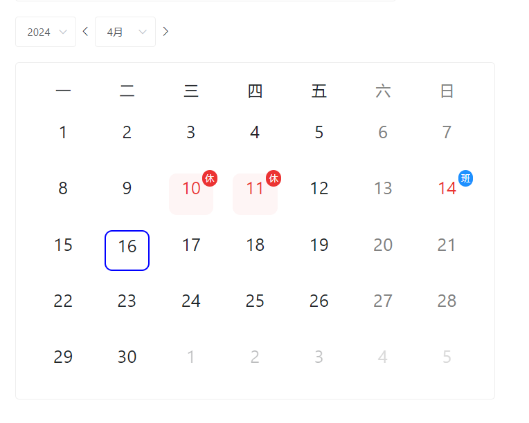

# 日历 

## 安装

~~~
composer require thefunpower/calendar  
~~~

依赖`thefunpower/vue`

~~~
composer require thefunpower/vue
~~~

## 使用

- 输出HTML代码

~~~
$year = 2024;
$month = 4;  

$calendar = calendar_table::create([
  'url'=>'/attend/config/ajax',
  'year'=>$year,
  'month'=>$month, 
  'html'=>1,
  'click'=>'calendar', 
]); 

$vue->method("calendar(date)"," 
  this.calendar_click_li_actived = date;
  console.log(date);
"); 
~~~

输出

~~~
<?=$calendar?>
~~~
- 使用AJAX数据
~~~
$year = g("year");
$month = g("month");
$type = g("type");
//设置企业工作日，一般周一到周五,如果周六上班对应数字6，周日上班对应数字0
\calendar_table::set("usually",[1,2,3,4,5]);
//设置法定节假日
\calendar_table::set("holiday",['2024-04-10','2024-04-11']);
//设置补班日，周末原本是休息，因节假日调整为上班的
\calendar_table::set("workday",['2024-04-14','2024-04-18']);  
return \calendar_table::ajax([
    'year'=>$year,
    'month'=>$month,
    'usually'=>$usually,
    'type'=>$type,
]);
~~~

## css

请自行复制 `css.css`

## action用法

~~~
do_action("calendar_table", $data);
~~~

处理
~~~
add_action("calendar_table", function(&$data)use($holiday,$holidays,$work) { 
    foreach($data as &$v){
        foreach($v as &$vv){ 
            if( $holiday && in_array( $vv['full'],$holiday) ){
                $vv['title'] = $holidays[$vv['full']];
            }
        }
    }
});
~~~

## 效果图

  

### 开源协议 

[Apache License 2.0](LICENSE)
